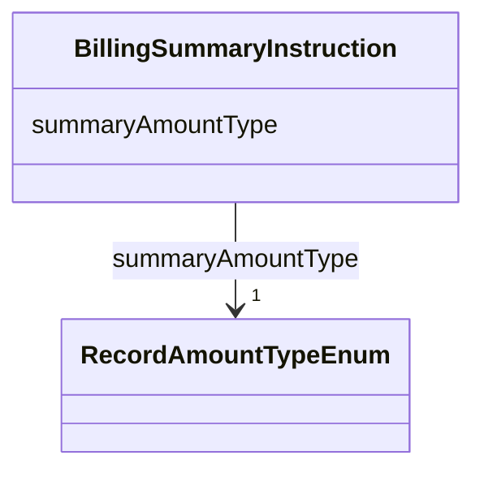

```mermaid
 classDiagram
    class BillingSummaryInstruction
    click BillingSummaryInstruction href "../BillingSummaryInstruction"
      BillingSummaryInstruction : summaryAmountType
        
          
    
        
        
        BillingSummaryInstruction --> "1" RecordAmountTypeEnum : summaryAmountType
        click RecordAmountTypeEnum href "../RecordAmountTypeEnum"
    

        
      
```
