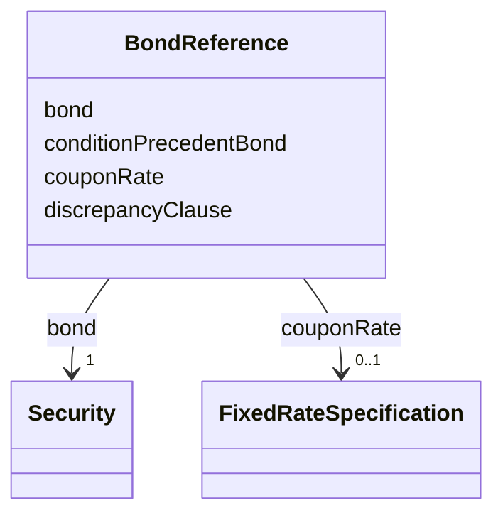

```mermaid
 classDiagram
    class BondReference
    click BondReference href "../BondReference"
      BondReference : bond
        
          
    
        
        
        BondReference --> "1" Security : bond
        click Security href "../Security"
    

        
      BondReference : conditionPrecedentBond
        
      BondReference : couponRate
        
          
    
        
        
        BondReference --> "0..1" FixedRateSpecification : couponRate
        click FixedRateSpecification href "../FixedRateSpecification"
    

        
      BondReference : discrepancyClause
        
      
```
