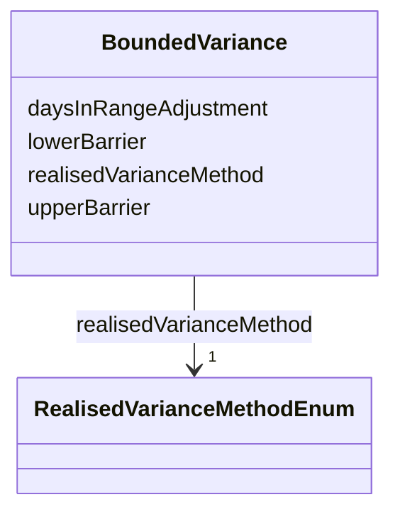

```mermaid
 classDiagram
    class BoundedVariance
    click BoundedVariance href "../BoundedVariance"
      BoundedVariance : daysInRangeAdjustment
        
      BoundedVariance : lowerBarrier
        
      BoundedVariance : realisedVarianceMethod
        
          
    
        
        
        BoundedVariance --> "1" RealisedVarianceMethodEnum : realisedVarianceMethod
        click RealisedVarianceMethodEnum href "../RealisedVarianceMethodEnum"
    

        
      BoundedVariance : upperBarrier
        
      
```
