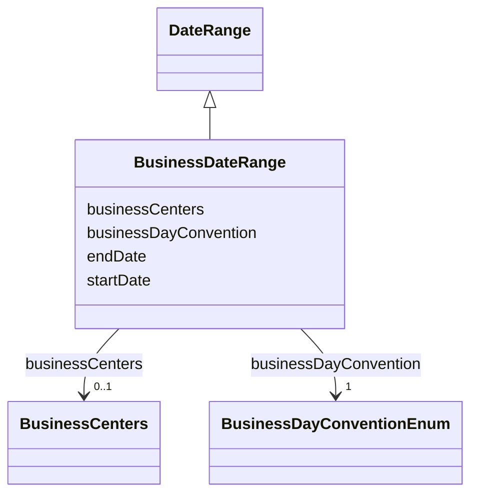

```mermaid
 classDiagram
    class BusinessDateRange
    click BusinessDateRange href "../BusinessDateRange"
      DateRange <|-- BusinessDateRange
        click DateRange href "../DateRange"
      
      BusinessDateRange : businessCenters
        
          
    
        
        
        BusinessDateRange --> "0..1" BusinessCenters : businessCenters
        click BusinessCenters href "../BusinessCenters"
    

        
      BusinessDateRange : businessDayConvention
        
          
    
        
        
        BusinessDateRange --> "1" BusinessDayConventionEnum : businessDayConvention
        click BusinessDayConventionEnum href "../BusinessDayConventionEnum"
    

        
      BusinessDateRange : endDate
        
      BusinessDateRange : startDate
        
      
```
