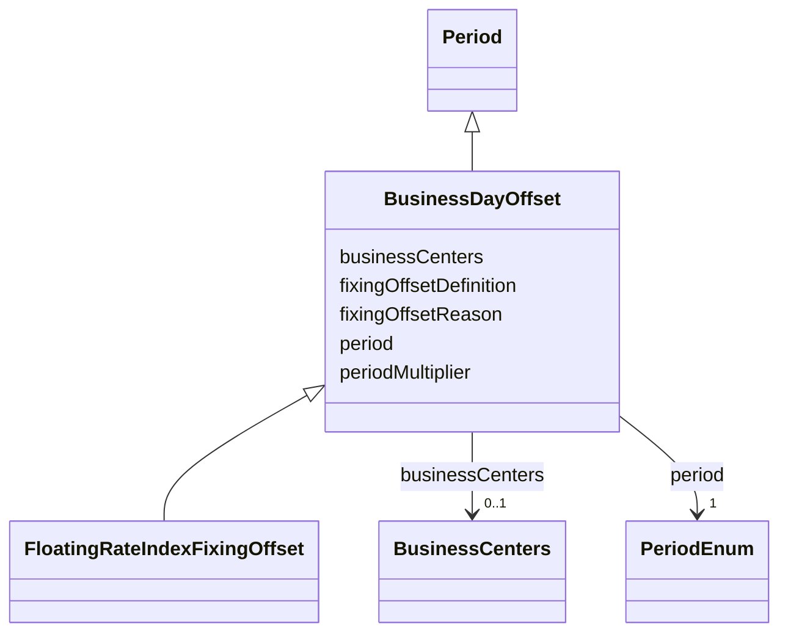

```mermaid
 classDiagram
    class BusinessDayOffset
    click BusinessDayOffset href "../BusinessDayOffset"
      Period <|-- BusinessDayOffset
        click Period href "../Period"
      

      BusinessDayOffset <|-- FloatingRateIndexFixingOffset
        click FloatingRateIndexFixingOffset href "../FloatingRateIndexFixingOffset"
      

      BusinessDayOffset : businessCenters
        
          
    
        
        
        BusinessDayOffset --> "0..1" BusinessCenters : businessCenters
        click BusinessCenters href "../BusinessCenters"
    

        
      BusinessDayOffset : fixingOffsetDefinition
        
      BusinessDayOffset : fixingOffsetReason
        
      BusinessDayOffset : period
        
          
    
        
        
        BusinessDayOffset --> "1" PeriodEnum : period
        click PeriodEnum href "../PeriodEnum"
    

        
      BusinessDayOffset : periodMultiplier
        
      
```
