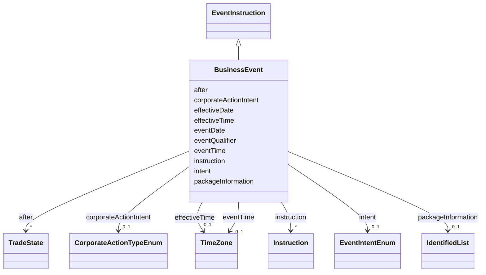

```mermaid
 classDiagram
    class BusinessEvent
    click BusinessEvent href "../BusinessEvent"
      EventInstruction <|-- BusinessEvent
        click EventInstruction href "../EventInstruction"
      
      BusinessEvent : after
        
          
    
        
        
        BusinessEvent --> "*" TradeState : after
        click TradeState href "../TradeState"
    

        
      BusinessEvent : corporateActionIntent
        
          
    
        
        
        BusinessEvent --> "0..1" CorporateActionTypeEnum : corporateActionIntent
        click CorporateActionTypeEnum href "../CorporateActionTypeEnum"
    

        
      BusinessEvent : effectiveDate
        
      BusinessEvent : effectiveTime
        
          
    
        
        
        BusinessEvent --> "0..1" TimeZone : effectiveTime
        click TimeZone href "../TimeZone"
    

        
      BusinessEvent : eventDate
        
      BusinessEvent : eventQualifier
        
      BusinessEvent : eventTime
        
          
    
        
        
        BusinessEvent --> "0..1" TimeZone : eventTime
        click TimeZone href "../TimeZone"
    

        
      BusinessEvent : instruction
        
          
    
        
        
        BusinessEvent --> "*" Instruction : instruction
        click Instruction href "../Instruction"
    

        
      BusinessEvent : intent
        
          
    
        
        
        BusinessEvent --> "0..1" EventIntentEnum : intent
        click EventIntentEnum href "../EventIntentEnum"
    

        
      BusinessEvent : packageInformation
        
          
    
        
        
        BusinessEvent --> "0..1" IdentifiedList : packageInformation
        click IdentifiedList href "../IdentifiedList"
    

        
      
```
