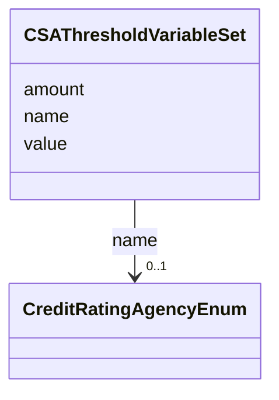

```mermaid
 classDiagram
    class CSAThresholdVariableSet
    click CSAThresholdVariableSet href "../CSAThresholdVariableSet"
      CSAThresholdVariableSet : amount
        
      CSAThresholdVariableSet : name
        
          
    
        
        
        CSAThresholdVariableSet --> "0..1" CreditRatingAgencyEnum : name
        click CreditRatingAgencyEnum href "../CreditRatingAgencyEnum"
    

        
      CSAThresholdVariableSet : value
        
      
```
