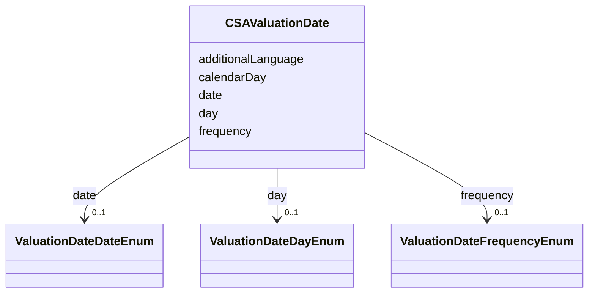

```mermaid
 classDiagram
    class CSAValuationDate
    click CSAValuationDate href "../CSAValuationDate"
      CSAValuationDate : additionalLanguage
        
      CSAValuationDate : calendarDay
        
      CSAValuationDate : date
        
          
    
        
        
        CSAValuationDate --> "0..1" ValuationDateDateEnum : date
        click ValuationDateDateEnum href "../ValuationDateDateEnum"
    

        
      CSAValuationDate : day
        
          
    
        
        
        CSAValuationDate --> "0..1" ValuationDateDayEnum : day
        click ValuationDateDayEnum href "../ValuationDateDayEnum"
    

        
      CSAValuationDate : frequency
        
          
    
        
        
        CSAValuationDate --> "0..1" ValuationDateFrequencyEnum : frequency
        click ValuationDateFrequencyEnum href "../ValuationDateFrequencyEnum"
    

        
      
```
