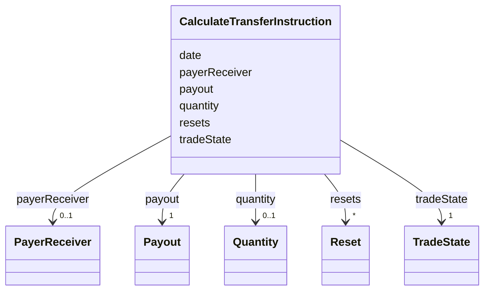

```mermaid
 classDiagram
    class CalculateTransferInstruction
    click CalculateTransferInstruction href "../CalculateTransferInstruction"
      CalculateTransferInstruction : date
        
      CalculateTransferInstruction : payerReceiver
        
          
    
        
        
        CalculateTransferInstruction --> "0..1" PayerReceiver : payerReceiver
        click PayerReceiver href "../PayerReceiver"
    

        
      CalculateTransferInstruction : payout
        
          
    
        
        
        CalculateTransferInstruction --> "1" Payout : payout
        click Payout href "../Payout"
    

        
      CalculateTransferInstruction : quantity
        
          
    
        
        
        CalculateTransferInstruction --> "0..1" Quantity : quantity
        click Quantity href "../Quantity"
    

        
      CalculateTransferInstruction : resets
        
          
    
        
        
        CalculateTransferInstruction --> "*" Reset : resets
        click Reset href "../Reset"
    

        
      CalculateTransferInstruction : tradeState
        
          
    
        
        
        CalculateTransferInstruction --> "1" TradeState : tradeState
        click TradeState href "../TradeState"
    

        
      
```
