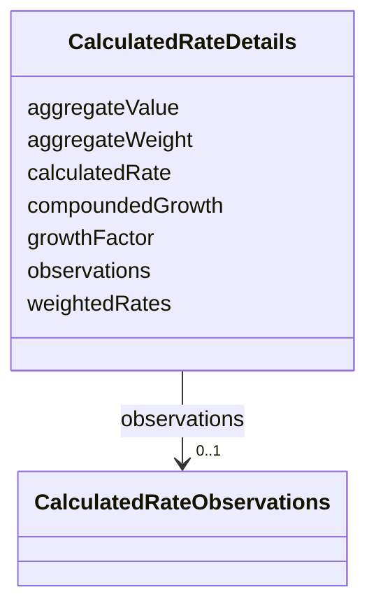

```mermaid
 classDiagram
    class CalculatedRateDetails
    click CalculatedRateDetails href "../CalculatedRateDetails"
      CalculatedRateDetails : aggregateValue
        
      CalculatedRateDetails : aggregateWeight
        
      CalculatedRateDetails : calculatedRate
        
      CalculatedRateDetails : compoundedGrowth
        
      CalculatedRateDetails : growthFactor
        
      CalculatedRateDetails : observations
        
          
    
        
        
        CalculatedRateDetails --> "0..1" CalculatedRateObservations : observations
        click CalculatedRateObservations href "../CalculatedRateObservations"
    

        
      CalculatedRateDetails : weightedRates
        
      
```
