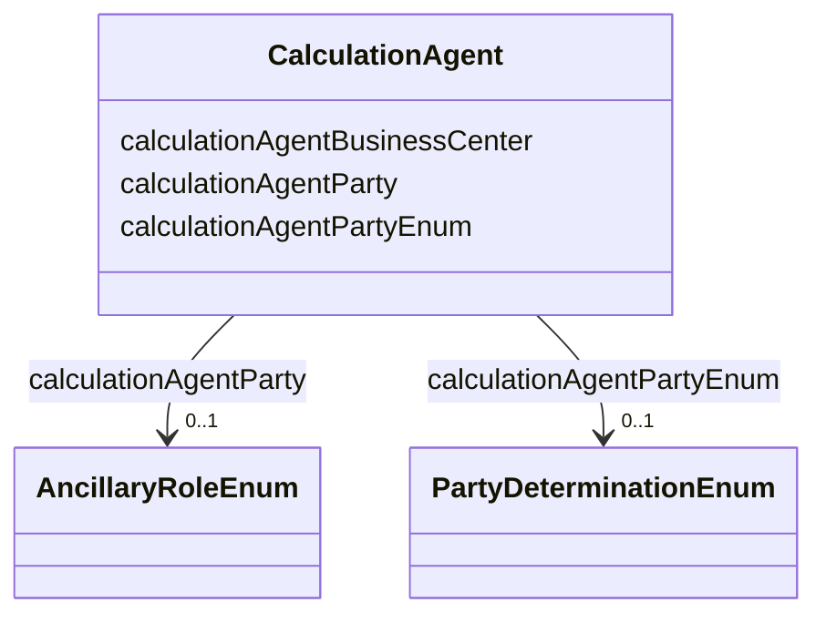

```mermaid
 classDiagram
    class CalculationAgent
    click CalculationAgent href "../CalculationAgent"
      CalculationAgent : calculationAgentBusinessCenter
        
      CalculationAgent : calculationAgentParty
        
          
    
        
        
        CalculationAgent --> "0..1" AncillaryRoleEnum : calculationAgentParty
        click AncillaryRoleEnum href "../AncillaryRoleEnum"
    

        
      CalculationAgent : calculationAgentPartyEnum
        
          
    
        
        
        CalculationAgent --> "0..1" PartyDeterminationEnum : calculationAgentPartyEnum
        click PartyDeterminationEnum href "../PartyDeterminationEnum"
    

        
      
```
