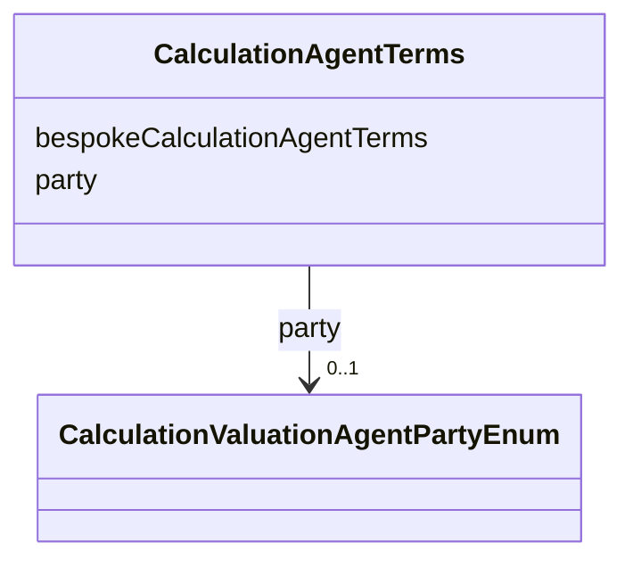

```mermaid
 classDiagram
    class CalculationAgentTerms
    click CalculationAgentTerms href "../CalculationAgentTerms"
      CalculationAgentTerms : bespokeCalculationAgentTerms
        
      CalculationAgentTerms : party
        
          
    
        
        
        CalculationAgentTerms --> "0..1" CalculationValuationAgentPartyEnum : party
        click CalculationValuationAgentPartyEnum href "../CalculationValuationAgentPartyEnum"
    

        
      
```
