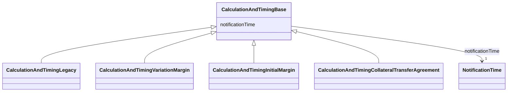

```mermaid
 classDiagram
    class CalculationAndTimingBase
    click CalculationAndTimingBase href "../CalculationAndTimingBase"
      CalculationAndTimingBase <|-- CalculationAndTimingLegacy
        click CalculationAndTimingLegacy href "../CalculationAndTimingLegacy"
      CalculationAndTimingBase <|-- CalculationAndTimingVariationMargin
        click CalculationAndTimingVariationMargin href "../CalculationAndTimingVariationMargin"
      CalculationAndTimingBase <|-- CalculationAndTimingInitialMargin
        click CalculationAndTimingInitialMargin href "../CalculationAndTimingInitialMargin"
      CalculationAndTimingBase <|-- CalculationAndTimingCollateralTransferAgreement
        click CalculationAndTimingCollateralTransferAgreement href "../CalculationAndTimingCollateralTransferAgreement"
      
      CalculationAndTimingBase : notificationTime
        
          
    
        
        
        CalculationAndTimingBase --> "1" NotificationTime : notificationTime
        click NotificationTime href "../NotificationTime"
    

        
      
```
