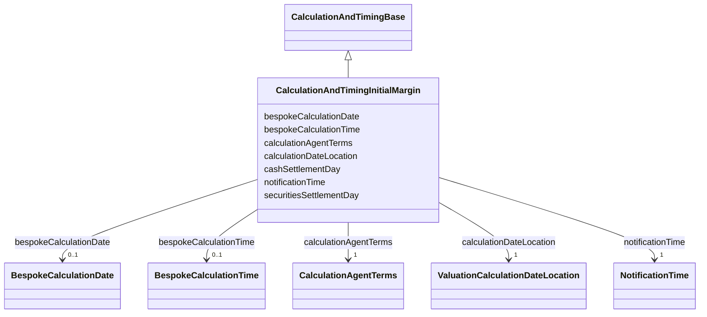

```mermaid
 classDiagram
    class CalculationAndTimingInitialMargin
    click CalculationAndTimingInitialMargin href "../CalculationAndTimingInitialMargin"
      CalculationAndTimingBase <|-- CalculationAndTimingInitialMargin
        click CalculationAndTimingBase href "../CalculationAndTimingBase"
      
      CalculationAndTimingInitialMargin : bespokeCalculationDate
        
          
    
        
        
        CalculationAndTimingInitialMargin --> "0..1" BespokeCalculationDate : bespokeCalculationDate
        click BespokeCalculationDate href "../BespokeCalculationDate"
    

        
      CalculationAndTimingInitialMargin : bespokeCalculationTime
        
          
    
        
        
        CalculationAndTimingInitialMargin --> "0..1" BespokeCalculationTime : bespokeCalculationTime
        click BespokeCalculationTime href "../BespokeCalculationTime"
    

        
      CalculationAndTimingInitialMargin : calculationAgentTerms
        
          
    
        
        
        CalculationAndTimingInitialMargin --> "1" CalculationAgentTerms : calculationAgentTerms
        click CalculationAgentTerms href "../CalculationAgentTerms"
    

        
      CalculationAndTimingInitialMargin : calculationDateLocation
        
          
    
        
        
        CalculationAndTimingInitialMargin --> "1" ValuationCalculationDateLocation : calculationDateLocation
        click ValuationCalculationDateLocation href "../ValuationCalculationDateLocation"
    

        
      CalculationAndTimingInitialMargin : cashSettlementDay
        
      CalculationAndTimingInitialMargin : notificationTime
        
          
    
        
        
        CalculationAndTimingInitialMargin --> "1" NotificationTime : notificationTime
        click NotificationTime href "../NotificationTime"
    

        
      CalculationAndTimingInitialMargin : securitiesSettlementDay
        
      
```
