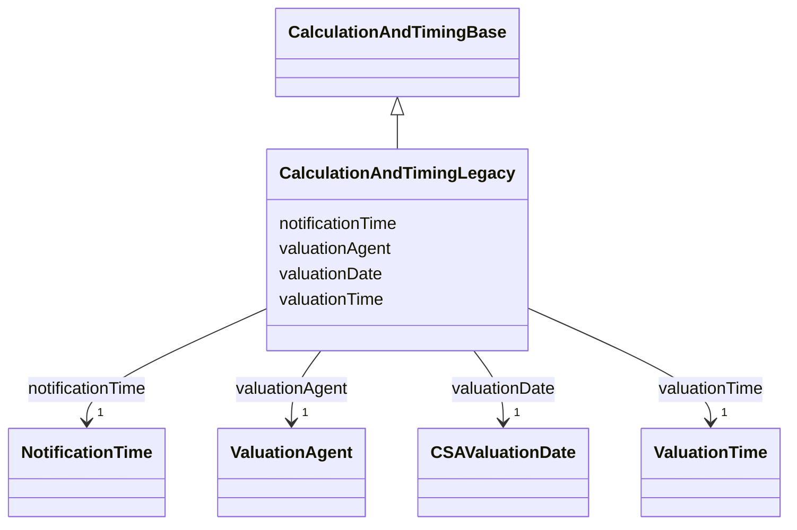

```mermaid
 classDiagram
    class CalculationAndTimingLegacy
    click CalculationAndTimingLegacy href "../CalculationAndTimingLegacy"
      CalculationAndTimingBase <|-- CalculationAndTimingLegacy
        click CalculationAndTimingBase href "../CalculationAndTimingBase"
      
      CalculationAndTimingLegacy : notificationTime
        
          
    
        
        
        CalculationAndTimingLegacy --> "1" NotificationTime : notificationTime
        click NotificationTime href "../NotificationTime"
    

        
      CalculationAndTimingLegacy : valuationAgent
        
          
    
        
        
        CalculationAndTimingLegacy --> "1" ValuationAgent : valuationAgent
        click ValuationAgent href "../ValuationAgent"
    

        
      CalculationAndTimingLegacy : valuationDate
        
          
    
        
        
        CalculationAndTimingLegacy --> "1" CSAValuationDate : valuationDate
        click CSAValuationDate href "../CSAValuationDate"
    

        
      CalculationAndTimingLegacy : valuationTime
        
          
    
        
        
        CalculationAndTimingLegacy --> "1" ValuationTime : valuationTime
        click ValuationTime href "../ValuationTime"
    

        
      
```
