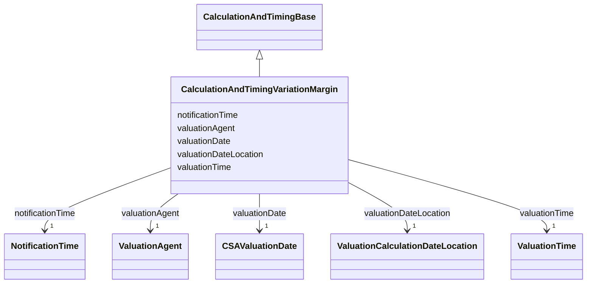

```mermaid
 classDiagram
    class CalculationAndTimingVariationMargin
    click CalculationAndTimingVariationMargin href "../CalculationAndTimingVariationMargin"
      CalculationAndTimingBase <|-- CalculationAndTimingVariationMargin
        click CalculationAndTimingBase href "../CalculationAndTimingBase"
      
      CalculationAndTimingVariationMargin : notificationTime
        
          
    
        
        
        CalculationAndTimingVariationMargin --> "1" NotificationTime : notificationTime
        click NotificationTime href "../NotificationTime"
    

        
      CalculationAndTimingVariationMargin : valuationAgent
        
          
    
        
        
        CalculationAndTimingVariationMargin --> "1" ValuationAgent : valuationAgent
        click ValuationAgent href "../ValuationAgent"
    

        
      CalculationAndTimingVariationMargin : valuationDate
        
          
    
        
        
        CalculationAndTimingVariationMargin --> "1" CSAValuationDate : valuationDate
        click CSAValuationDate href "../CSAValuationDate"
    

        
      CalculationAndTimingVariationMargin : valuationDateLocation
        
          
    
        
        
        CalculationAndTimingVariationMargin --> "1" ValuationCalculationDateLocation : valuationDateLocation
        click ValuationCalculationDateLocation href "../ValuationCalculationDateLocation"
    

        
      CalculationAndTimingVariationMargin : valuationTime
        
          
    
        
        
        CalculationAndTimingVariationMargin --> "1" ValuationTime : valuationTime
        click ValuationTime href "../ValuationTime"
    

        
      
```
