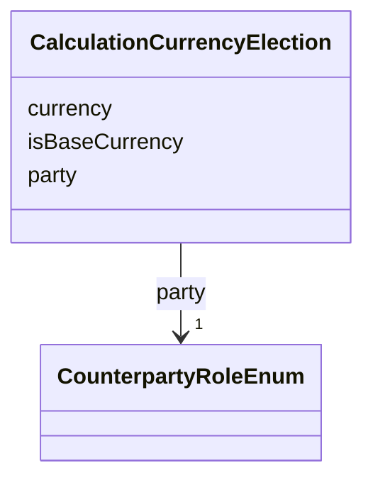

```mermaid
 classDiagram
    class CalculationCurrencyElection
    click CalculationCurrencyElection href "../CalculationCurrencyElection"
      CalculationCurrencyElection : currency
        
      CalculationCurrencyElection : isBaseCurrency
        
      CalculationCurrencyElection : party
        
          
    
        
        
        CalculationCurrencyElection --> "1" CounterpartyRoleEnum : party
        click CounterpartyRoleEnum href "../CounterpartyRoleEnum"
    

        
      
```
