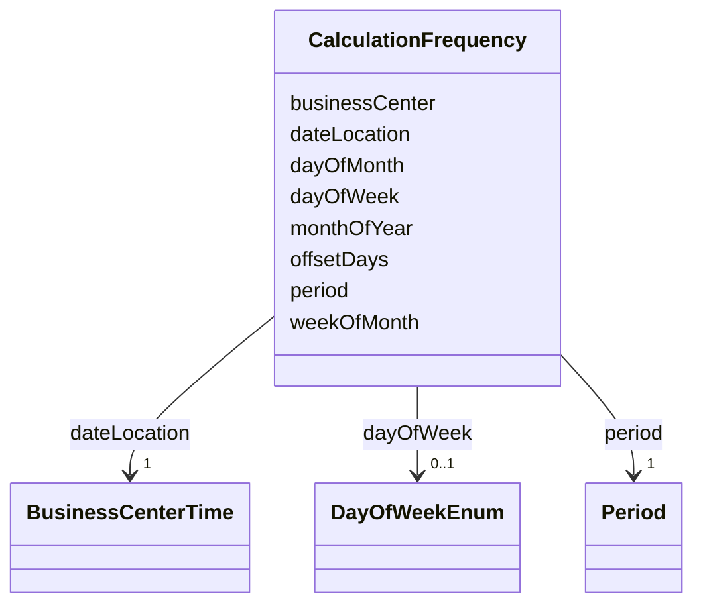

```mermaid
 classDiagram
    class CalculationFrequency
    click CalculationFrequency href "../CalculationFrequency"
      CalculationFrequency : businessCenter
        
      CalculationFrequency : dateLocation
        
          
    
        
        
        CalculationFrequency --> "1" BusinessCenterTime : dateLocation
        click BusinessCenterTime href "../BusinessCenterTime"
    

        
      CalculationFrequency : dayOfMonth
        
      CalculationFrequency : dayOfWeek
        
          
    
        
        
        CalculationFrequency --> "0..1" DayOfWeekEnum : dayOfWeek
        click DayOfWeekEnum href "../DayOfWeekEnum"
    

        
      CalculationFrequency : monthOfYear
        
      CalculationFrequency : offsetDays
        
      CalculationFrequency : period
        
          
    
        
        
        CalculationFrequency --> "1" Period : period
        click Period href "../Period"
    

        
      CalculationFrequency : weekOfMonth
        
      
```
