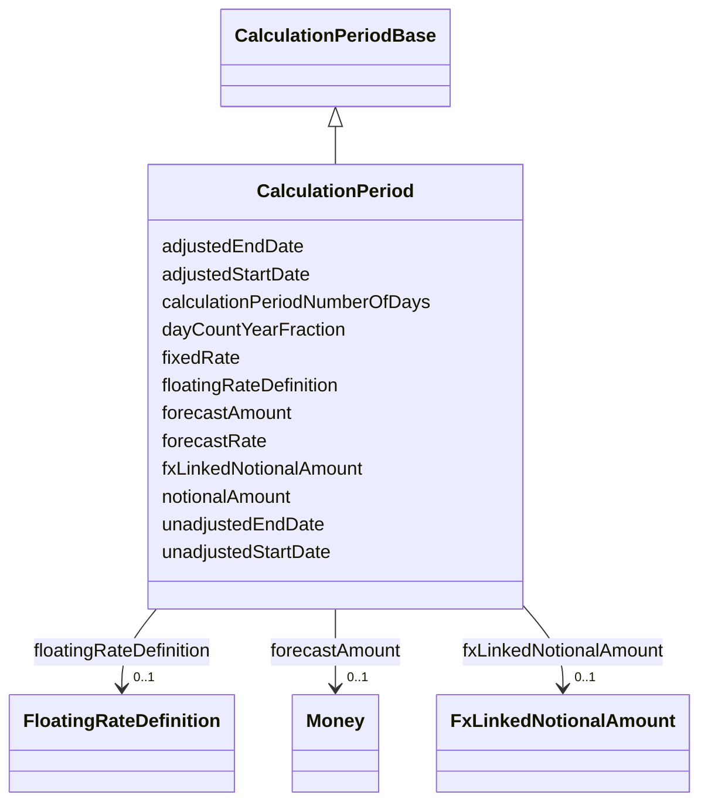

```mermaid
 classDiagram
    class CalculationPeriod
    click CalculationPeriod href "../CalculationPeriod"
      CalculationPeriodBase <|-- CalculationPeriod
        click CalculationPeriodBase href "../CalculationPeriodBase"
      
      CalculationPeriod : adjustedEndDate
        
      CalculationPeriod : adjustedStartDate
        
      CalculationPeriod : calculationPeriodNumberOfDays
        
      CalculationPeriod : dayCountYearFraction
        
      CalculationPeriod : fixedRate
        
      CalculationPeriod : floatingRateDefinition
        
          
    
        
        
        CalculationPeriod --> "0..1" FloatingRateDefinition : floatingRateDefinition
        click FloatingRateDefinition href "../FloatingRateDefinition"
    

        
      CalculationPeriod : forecastAmount
        
          
    
        
        
        CalculationPeriod --> "0..1" Money : forecastAmount
        click Money href "../Money"
    

        
      CalculationPeriod : forecastRate
        
      CalculationPeriod : fxLinkedNotionalAmount
        
          
    
        
        
        CalculationPeriod --> "0..1" FxLinkedNotionalAmount : fxLinkedNotionalAmount
        click FxLinkedNotionalAmount href "../FxLinkedNotionalAmount"
    

        
      CalculationPeriod : notionalAmount
        
      CalculationPeriod : unadjustedEndDate
        
      CalculationPeriod : unadjustedStartDate
        
      
```
