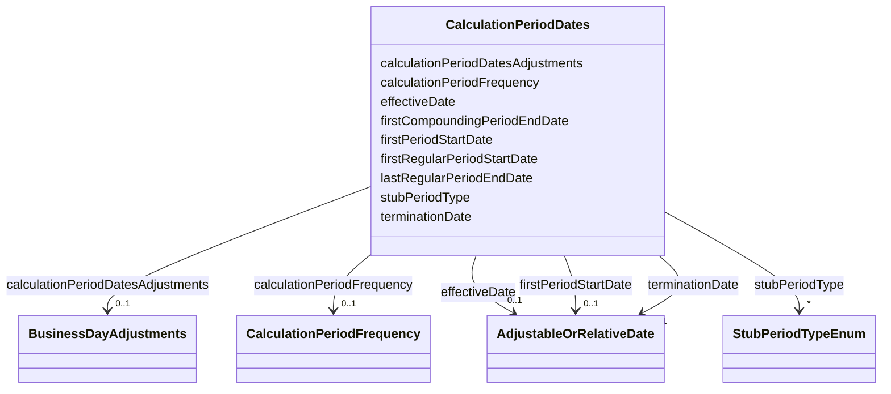

```mermaid
 classDiagram
    class CalculationPeriodDates
    click CalculationPeriodDates href "../CalculationPeriodDates"
      CalculationPeriodDates : calculationPeriodDatesAdjustments
        
          
    
        
        
        CalculationPeriodDates --> "0..1" BusinessDayAdjustments : calculationPeriodDatesAdjustments
        click BusinessDayAdjustments href "../BusinessDayAdjustments"
    

        
      CalculationPeriodDates : calculationPeriodFrequency
        
          
    
        
        
        CalculationPeriodDates --> "0..1" CalculationPeriodFrequency : calculationPeriodFrequency
        click CalculationPeriodFrequency href "../CalculationPeriodFrequency"
    

        
      CalculationPeriodDates : effectiveDate
        
          
    
        
        
        CalculationPeriodDates --> "0..1" AdjustableOrRelativeDate : effectiveDate
        click AdjustableOrRelativeDate href "../AdjustableOrRelativeDate"
    

        
      CalculationPeriodDates : firstCompoundingPeriodEndDate
        
      CalculationPeriodDates : firstPeriodStartDate
        
          
    
        
        
        CalculationPeriodDates --> "0..1" AdjustableOrRelativeDate : firstPeriodStartDate
        click AdjustableOrRelativeDate href "../AdjustableOrRelativeDate"
    

        
      CalculationPeriodDates : firstRegularPeriodStartDate
        
      CalculationPeriodDates : lastRegularPeriodEndDate
        
      CalculationPeriodDates : stubPeriodType
        
          
    
        
        
        CalculationPeriodDates --> "*" StubPeriodTypeEnum : stubPeriodType
        click StubPeriodTypeEnum href "../StubPeriodTypeEnum"
    

        
      CalculationPeriodDates : terminationDate
        
          
    
        
        
        CalculationPeriodDates --> "0..1" AdjustableOrRelativeDate : terminationDate
        click AdjustableOrRelativeDate href "../AdjustableOrRelativeDate"
    

        
      
```
