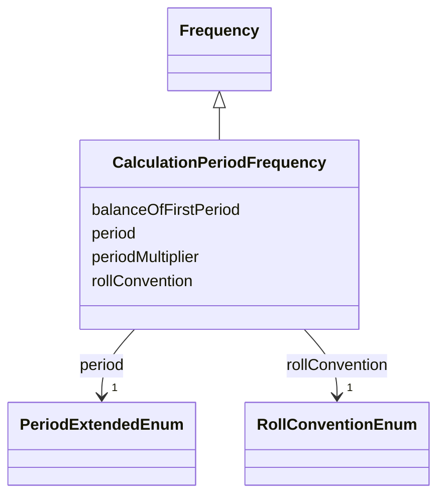

```mermaid
 classDiagram
    class CalculationPeriodFrequency
    click CalculationPeriodFrequency href "../CalculationPeriodFrequency"
      Frequency <|-- CalculationPeriodFrequency
        click Frequency href "../Frequency"
      
      CalculationPeriodFrequency : balanceOfFirstPeriod
        
      CalculationPeriodFrequency : period
        
          
    
        
        
        CalculationPeriodFrequency --> "1" PeriodExtendedEnum : period
        click PeriodExtendedEnum href "../PeriodExtendedEnum"
    

        
      CalculationPeriodFrequency : periodMultiplier
        
      CalculationPeriodFrequency : rollConvention
        
          
    
        
        
        CalculationPeriodFrequency --> "1" RollConventionEnum : rollConvention
        click RollConventionEnum href "../RollConventionEnum"
    

        
      
```
