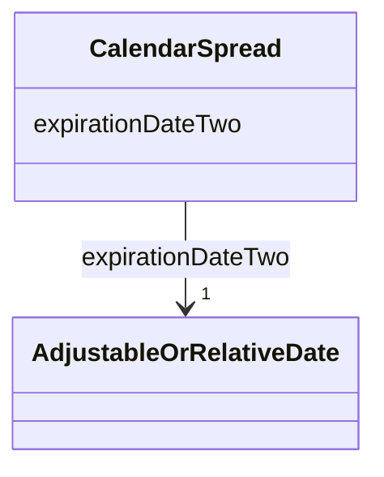

```mermaid
 classDiagram
    class CalendarSpread
    click CalendarSpread href "../CalendarSpread"
      CalendarSpread : expirationDateTwo
        
          
    
        
        
        CalendarSpread --> "1" AdjustableOrRelativeDate : expirationDateTwo
        click AdjustableOrRelativeDate href "../AdjustableOrRelativeDate"
    

        
      
```
