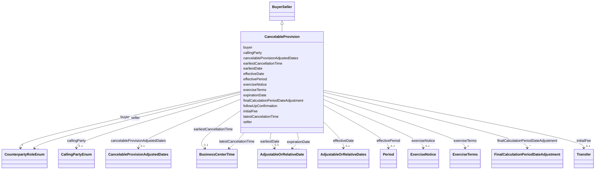

```mermaid
 classDiagram
    class CancelableProvision
    click CancelableProvision href "../CancelableProvision"
      BuyerSeller <|-- CancelableProvision
        click BuyerSeller href "../BuyerSeller"
      
      CancelableProvision : buyer
        
          
    
        
        
        CancelableProvision --> "1" CounterpartyRoleEnum : buyer
        click CounterpartyRoleEnum href "../CounterpartyRoleEnum"
    

        
      CancelableProvision : callingParty
        
          
    
        
        
        CancelableProvision --> "0..1" CallingPartyEnum : callingParty
        click CallingPartyEnum href "../CallingPartyEnum"
    

        
      CancelableProvision : cancelableProvisionAdjustedDates
        
          
    
        
        
        CancelableProvision --> "0..1" CancelableProvisionAdjustedDates : cancelableProvisionAdjustedDates
        click CancelableProvisionAdjustedDates href "../CancelableProvisionAdjustedDates"
    

        
      CancelableProvision : earliestCancellationTime
        
          
    
        
        
        CancelableProvision --> "0..1" BusinessCenterTime : earliestCancellationTime
        click BusinessCenterTime href "../BusinessCenterTime"
    

        
      CancelableProvision : earliestDate
        
          
    
        
        
        CancelableProvision --> "0..1" AdjustableOrRelativeDate : earliestDate
        click AdjustableOrRelativeDate href "../AdjustableOrRelativeDate"
    

        
      CancelableProvision : effectiveDate
        
          
    
        
        
        CancelableProvision --> "0..1" AdjustableOrRelativeDates : effectiveDate
        click AdjustableOrRelativeDates href "../AdjustableOrRelativeDates"
    

        
      CancelableProvision : effectivePeriod
        
          
    
        
        
        CancelableProvision --> "0..1" Period : effectivePeriod
        click Period href "../Period"
    

        
      CancelableProvision : exerciseNotice
        
          
    
        
        
        CancelableProvision --> "0..1" ExerciseNotice : exerciseNotice
        click ExerciseNotice href "../ExerciseNotice"
    

        
      CancelableProvision : exerciseTerms
        
          
    
        
        
        CancelableProvision --> "1" ExerciseTerms : exerciseTerms
        click ExerciseTerms href "../ExerciseTerms"
    

        
      CancelableProvision : expirationDate
        
          
    
        
        
        CancelableProvision --> "0..1" AdjustableOrRelativeDate : expirationDate
        click AdjustableOrRelativeDate href "../AdjustableOrRelativeDate"
    

        
      CancelableProvision : finalCalculationPeriodDateAdjustment
        
          
    
        
        
        CancelableProvision --> "*" FinalCalculationPeriodDateAdjustment : finalCalculationPeriodDateAdjustment
        click FinalCalculationPeriodDateAdjustment href "../FinalCalculationPeriodDateAdjustment"
    

        
      CancelableProvision : followUpConfirmation
        
      CancelableProvision : initialFee
        
          
    
        
        
        CancelableProvision --> "0..1" Transfer : initialFee
        click Transfer href "../Transfer"
    

        
      CancelableProvision : latestCancelationTime
        
          
    
        
        
        CancelableProvision --> "0..1" BusinessCenterTime : latestCancelationTime
        click BusinessCenterTime href "../BusinessCenterTime"
    

        
      CancelableProvision : seller
        
          
    
        
        
        CancelableProvision --> "1" CounterpartyRoleEnum : seller
        click CounterpartyRoleEnum href "../CounterpartyRoleEnum"
    

        
      
```
