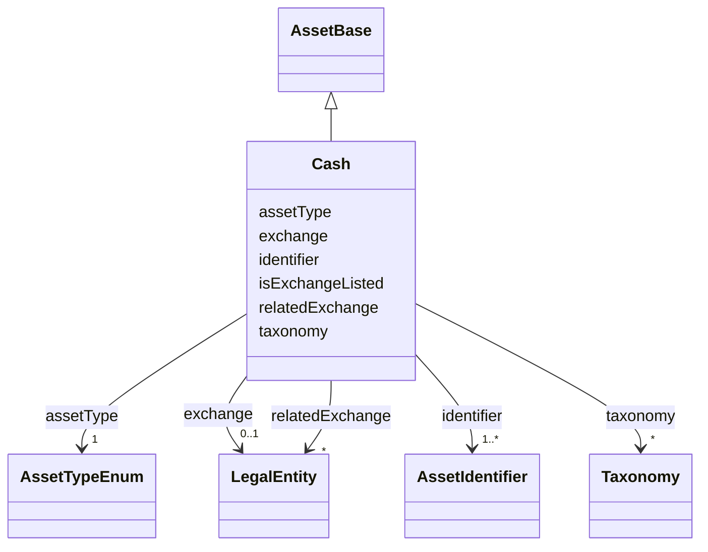

```mermaid
 classDiagram
    class Cash
    click Cash href "../Cash"
      AssetBase <|-- Cash
        click AssetBase href "../AssetBase"
      
      Cash : assetType
        
          
    
        
        
        Cash --> "1" AssetTypeEnum : assetType
        click AssetTypeEnum href "../AssetTypeEnum"
    

        
      Cash : exchange
        
          
    
        
        
        Cash --> "0..1" LegalEntity : exchange
        click LegalEntity href "../LegalEntity"
    

        
      Cash : identifier
        
          
    
        
        
        Cash --> "1..*" AssetIdentifier : identifier
        click AssetIdentifier href "../AssetIdentifier"
    

        
      Cash : isExchangeListed
        
      Cash : relatedExchange
        
          
    
        
        
        Cash --> "*" LegalEntity : relatedExchange
        click LegalEntity href "../LegalEntity"
    

        
      Cash : taxonomy
        
          
    
        
        
        Cash --> "*" Taxonomy : taxonomy
        click Taxonomy href "../Taxonomy"
    

        
      
```
