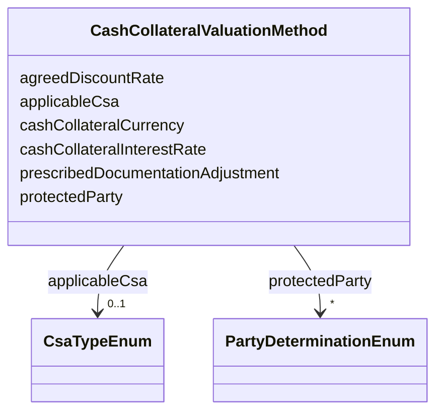

```mermaid
 classDiagram
    class CashCollateralValuationMethod
    click CashCollateralValuationMethod href "../CashCollateralValuationMethod"
      CashCollateralValuationMethod : agreedDiscountRate
        
      CashCollateralValuationMethod : applicableCsa
        
          
    
        
        
        CashCollateralValuationMethod --> "0..1" CsaTypeEnum : applicableCsa
        click CsaTypeEnum href "../CsaTypeEnum"
    

        
      CashCollateralValuationMethod : cashCollateralCurrency
        
      CashCollateralValuationMethod : cashCollateralInterestRate
        
      CashCollateralValuationMethod : prescribedDocumentationAdjustment
        
      CashCollateralValuationMethod : protectedParty
        
          
    
        
        
        CashCollateralValuationMethod --> "*" PartyDeterminationEnum : protectedParty
        click PartyDeterminationEnum href "../PartyDeterminationEnum"
    

        
      
```
