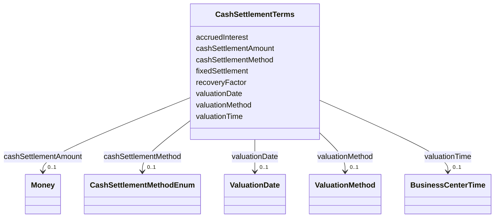

```mermaid
 classDiagram
    class CashSettlementTerms
    click CashSettlementTerms href "../CashSettlementTerms"
      CashSettlementTerms : accruedInterest
        
      CashSettlementTerms : cashSettlementAmount
        
          
    
        
        
        CashSettlementTerms --> "0..1" Money : cashSettlementAmount
        click Money href "../Money"
    

        
      CashSettlementTerms : cashSettlementMethod
        
          
    
        
        
        CashSettlementTerms --> "0..1" CashSettlementMethodEnum : cashSettlementMethod
        click CashSettlementMethodEnum href "../CashSettlementMethodEnum"
    

        
      CashSettlementTerms : fixedSettlement
        
      CashSettlementTerms : recoveryFactor
        
      CashSettlementTerms : valuationDate
        
          
    
        
        
        CashSettlementTerms --> "0..1" ValuationDate : valuationDate
        click ValuationDate href "../ValuationDate"
    

        
      CashSettlementTerms : valuationMethod
        
          
    
        
        
        CashSettlementTerms --> "0..1" ValuationMethod : valuationMethod
        click ValuationMethod href "../ValuationMethod"
    

        
      CashSettlementTerms : valuationTime
        
          
    
        
        
        CashSettlementTerms --> "0..1" BusinessCenterTime : valuationTime
        click BusinessCenterTime href "../BusinessCenterTime"
    

        
      
```
