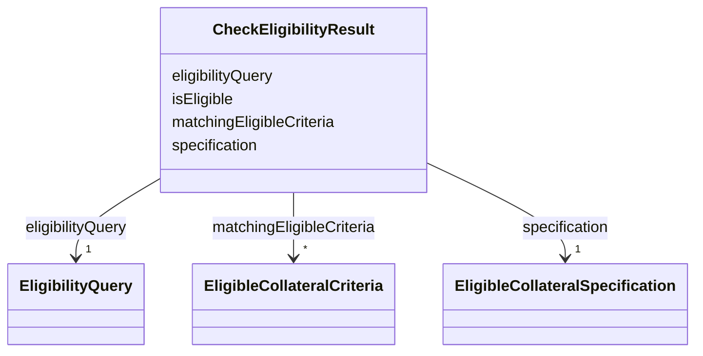

```mermaid
 classDiagram
    class CheckEligibilityResult
    click CheckEligibilityResult href "../CheckEligibilityResult"
      CheckEligibilityResult : eligibilityQuery
        
          
    
        
        
        CheckEligibilityResult --> "1" EligibilityQuery : eligibilityQuery
        click EligibilityQuery href "../EligibilityQuery"
    

        
      CheckEligibilityResult : isEligible
        
      CheckEligibilityResult : matchingEligibleCriteria
        
          
    
        
        
        CheckEligibilityResult --> "*" EligibleCollateralCriteria : matchingEligibleCriteria
        click EligibleCollateralCriteria href "../EligibleCollateralCriteria"
    

        
      CheckEligibilityResult : specification
        
          
    
        
        
        CheckEligibilityResult --> "1" EligibleCollateralSpecification : specification
        click EligibleCollateralSpecification href "../EligibleCollateralSpecification"
    

        
      
```
