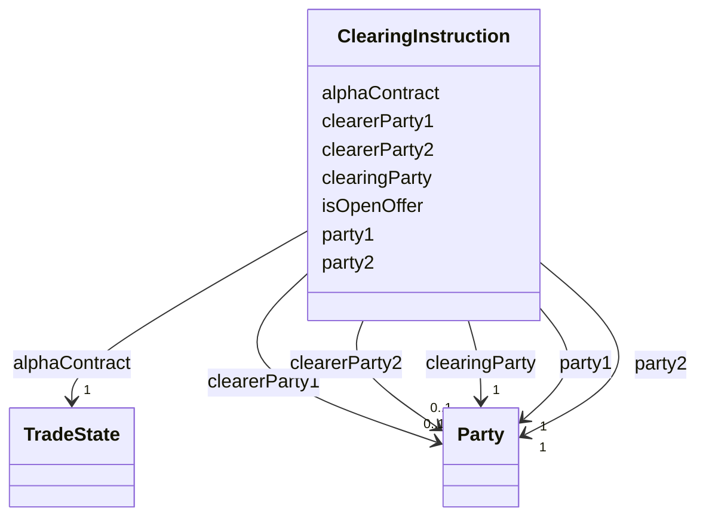

```mermaid
 classDiagram
    class ClearingInstruction
    click ClearingInstruction href "../ClearingInstruction"
      ClearingInstruction : alphaContract
        
          
    
        
        
        ClearingInstruction --> "1" TradeState : alphaContract
        click TradeState href "../TradeState"
    

        
      ClearingInstruction : clearerParty1
        
          
    
        
        
        ClearingInstruction --> "0..1" Party : clearerParty1
        click Party href "../Party"
    

        
      ClearingInstruction : clearerParty2
        
          
    
        
        
        ClearingInstruction --> "0..1" Party : clearerParty2
        click Party href "../Party"
    

        
      ClearingInstruction : clearingParty
        
          
    
        
        
        ClearingInstruction --> "1" Party : clearingParty
        click Party href "../Party"
    

        
      ClearingInstruction : isOpenOffer
        
      ClearingInstruction : party1
        
          
    
        
        
        ClearingInstruction --> "1" Party : party1
        click Party href "../Party"
    

        
      ClearingInstruction : party2
        
          
    
        
        
        ClearingInstruction --> "1" Party : party2
        click Party href "../Party"
    

        
      
```
