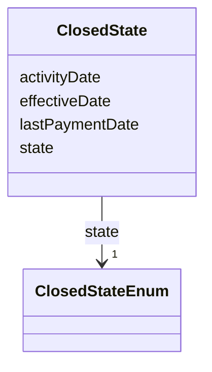

```mermaid
 classDiagram
    class ClosedState
    click ClosedState href "../ClosedState"
      ClosedState : activityDate
        
      ClosedState : effectiveDate
        
      ClosedState : lastPaymentDate
        
      ClosedState : state
        
          
    
        
        
        ClosedState --> "1" ClosedStateEnum : state
        click ClosedStateEnum href "../ClosedStateEnum"
    

        
      
```
