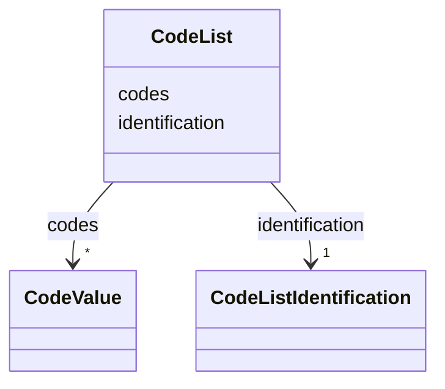

```mermaid
 classDiagram
    class CodeList
    click CodeList href "../CodeList"
      CodeList : codes
        
          
    
        
        
        CodeList --> "*" CodeValue : codes
        click CodeValue href "../CodeValue"
    

        
      CodeList : identification
        
          
    
        
        
        CodeList --> "1" CodeListIdentification : identification
        click CodeListIdentification href "../CodeListIdentification"
    

        
      
```
