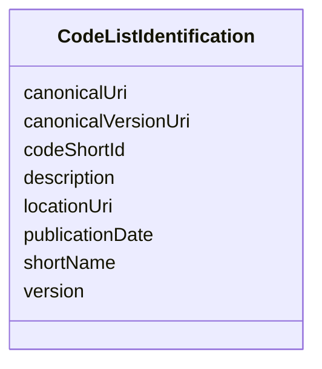

```mermaid
 classDiagram
    class CodeListIdentification
    click CodeListIdentification href "../CodeListIdentification"
      CodeListIdentification : canonicalUri
        
      CodeListIdentification : canonicalVersionUri
        
      CodeListIdentification : codeShortId
        
      CodeListIdentification : description
        
      CodeListIdentification : locationUri
        
      CodeListIdentification : publicationDate
        
      CodeListIdentification : shortName
        
      CodeListIdentification : version
        
      
```
