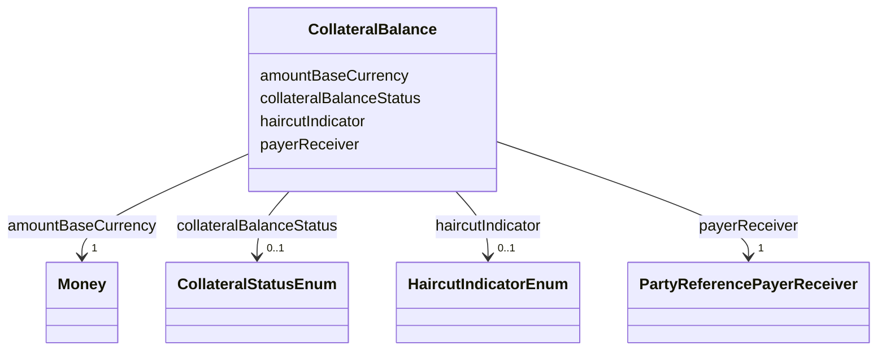

```mermaid
 classDiagram
    class CollateralBalance
    click CollateralBalance href "../CollateralBalance"
      CollateralBalance : amountBaseCurrency
        
          
    
        
        
        CollateralBalance --> "1" Money : amountBaseCurrency
        click Money href "../Money"
    

        
      CollateralBalance : collateralBalanceStatus
        
          
    
        
        
        CollateralBalance --> "0..1" CollateralStatusEnum : collateralBalanceStatus
        click CollateralStatusEnum href "../CollateralStatusEnum"
    

        
      CollateralBalance : haircutIndicator
        
          
    
        
        
        CollateralBalance --> "0..1" HaircutIndicatorEnum : haircutIndicator
        click HaircutIndicatorEnum href "../HaircutIndicatorEnum"
    

        
      CollateralBalance : payerReceiver
        
          
    
        
        
        CollateralBalance --> "1" PartyReferencePayerReceiver : payerReceiver
        click PartyReferencePayerReceiver href "../PartyReferencePayerReceiver"
    

        
      
```
