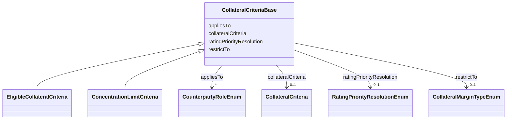

```mermaid
 classDiagram
    class CollateralCriteriaBase
    click CollateralCriteriaBase href "../CollateralCriteriaBase"
      CollateralCriteriaBase <|-- EligibleCollateralCriteria
        click EligibleCollateralCriteria href "../EligibleCollateralCriteria"
      CollateralCriteriaBase <|-- ConcentrationLimitCriteria
        click ConcentrationLimitCriteria href "../ConcentrationLimitCriteria"
      
      CollateralCriteriaBase : appliesTo
        
          
    
        
        
        CollateralCriteriaBase --> "*" CounterpartyRoleEnum : appliesTo
        click CounterpartyRoleEnum href "../CounterpartyRoleEnum"
    

        
      CollateralCriteriaBase : collateralCriteria
        
          
    
        
        
        CollateralCriteriaBase --> "0..1" CollateralCriteria : collateralCriteria
        click CollateralCriteria href "../CollateralCriteria"
    

        
      CollateralCriteriaBase : ratingPriorityResolution
        
          
    
        
        
        CollateralCriteriaBase --> "0..1" RatingPriorityResolutionEnum : ratingPriorityResolution
        click RatingPriorityResolutionEnum href "../RatingPriorityResolutionEnum"
    

        
      CollateralCriteriaBase : restrictTo
        
          
    
        
        
        CollateralCriteriaBase --> "0..1" CollateralMarginTypeEnum : restrictTo
        click CollateralMarginTypeEnum href "../CollateralMarginTypeEnum"
    

        
      
```
