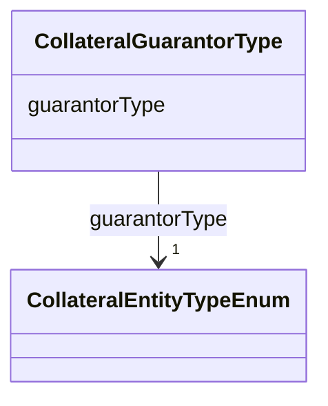

```mermaid
 classDiagram
    class CollateralGuarantorType
    click CollateralGuarantorType href "../CollateralGuarantorType"
      CollateralGuarantorType : guarantorType
        
          
    
        
        
        CollateralGuarantorType --> "1" CollateralEntityTypeEnum : guarantorType
        click CollateralEntityTypeEnum href "../CollateralEntityTypeEnum"
    

        
      
```
