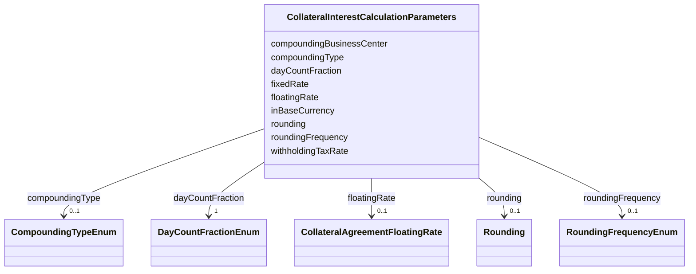

```mermaid
 classDiagram
    class CollateralInterestCalculationParameters
    click CollateralInterestCalculationParameters href "../CollateralInterestCalculationParameters"
      CollateralInterestCalculationParameters : compoundingBusinessCenter
        
      CollateralInterestCalculationParameters : compoundingType
        
          
    
        
        
        CollateralInterestCalculationParameters --> "0..1" CompoundingTypeEnum : compoundingType
        click CompoundingTypeEnum href "../CompoundingTypeEnum"
    

        
      CollateralInterestCalculationParameters : dayCountFraction
        
          
    
        
        
        CollateralInterestCalculationParameters --> "1" DayCountFractionEnum : dayCountFraction
        click DayCountFractionEnum href "../DayCountFractionEnum"
    

        
      CollateralInterestCalculationParameters : fixedRate
        
      CollateralInterestCalculationParameters : floatingRate
        
          
    
        
        
        CollateralInterestCalculationParameters --> "0..1" CollateralAgreementFloatingRate : floatingRate
        click CollateralAgreementFloatingRate href "../CollateralAgreementFloatingRate"
    

        
      CollateralInterestCalculationParameters : inBaseCurrency
        
      CollateralInterestCalculationParameters : rounding
        
          
    
        
        
        CollateralInterestCalculationParameters --> "0..1" Rounding : rounding
        click Rounding href "../Rounding"
    

        
      CollateralInterestCalculationParameters : roundingFrequency
        
          
    
        
        
        CollateralInterestCalculationParameters --> "0..1" RoundingFrequencyEnum : roundingFrequency
        click RoundingFrequencyEnum href "../RoundingFrequencyEnum"
    

        
      CollateralInterestCalculationParameters : withholdingTaxRate
        
      
```
