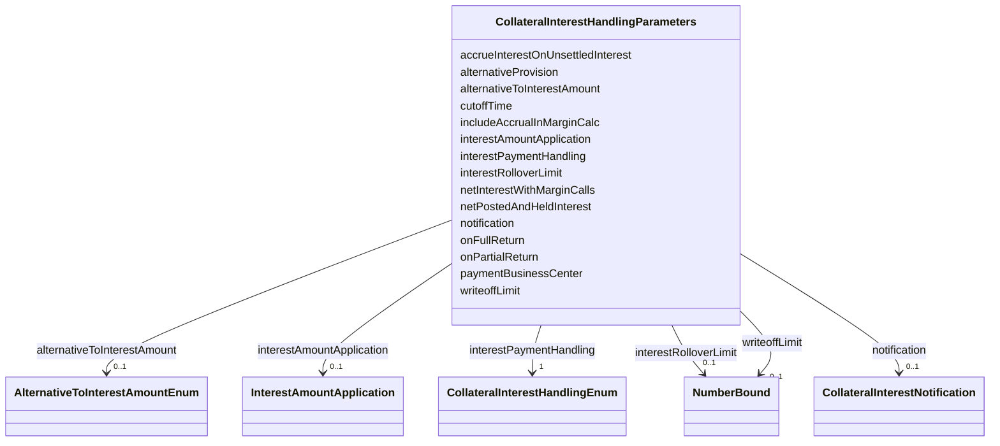

```mermaid
 classDiagram
    class CollateralInterestHandlingParameters
    click CollateralInterestHandlingParameters href "../CollateralInterestHandlingParameters"
      CollateralInterestHandlingParameters : accrueInterestOnUnsettledInterest
        
      CollateralInterestHandlingParameters : alternativeProvision
        
      CollateralInterestHandlingParameters : alternativeToInterestAmount
        
          
    
        
        
        CollateralInterestHandlingParameters --> "0..1" AlternativeToInterestAmountEnum : alternativeToInterestAmount
        click AlternativeToInterestAmountEnum href "../AlternativeToInterestAmountEnum"
    

        
      CollateralInterestHandlingParameters : cutoffTime
        
      CollateralInterestHandlingParameters : includeAccrualInMarginCalc
        
      CollateralInterestHandlingParameters : interestAmountApplication
        
          
    
        
        
        CollateralInterestHandlingParameters --> "0..1" InterestAmountApplication : interestAmountApplication
        click InterestAmountApplication href "../InterestAmountApplication"
    

        
      CollateralInterestHandlingParameters : interestPaymentHandling
        
          
    
        
        
        CollateralInterestHandlingParameters --> "1" CollateralInterestHandlingEnum : interestPaymentHandling
        click CollateralInterestHandlingEnum href "../CollateralInterestHandlingEnum"
    

        
      CollateralInterestHandlingParameters : interestRolloverLimit
        
          
    
        
        
        CollateralInterestHandlingParameters --> "0..1" NumberBound : interestRolloverLimit
        click NumberBound href "../NumberBound"
    

        
      CollateralInterestHandlingParameters : netInterestWithMarginCalls
        
      CollateralInterestHandlingParameters : netPostedAndHeldInterest
        
      CollateralInterestHandlingParameters : notification
        
          
    
        
        
        CollateralInterestHandlingParameters --> "0..1" CollateralInterestNotification : notification
        click CollateralInterestNotification href "../CollateralInterestNotification"
    

        
      CollateralInterestHandlingParameters : onFullReturn
        
      CollateralInterestHandlingParameters : onPartialReturn
        
      CollateralInterestHandlingParameters : paymentBusinessCenter
        
      CollateralInterestHandlingParameters : writeoffLimit
        
          
    
        
        
        CollateralInterestHandlingParameters --> "0..1" NumberBound : writeoffLimit
        click NumberBound href "../NumberBound"
    

        
      
```
