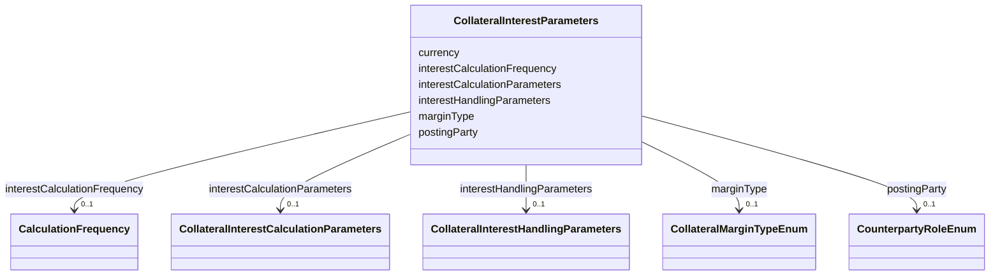

```mermaid
 classDiagram
    class CollateralInterestParameters
    click CollateralInterestParameters href "../CollateralInterestParameters"
      CollateralInterestParameters : currency
        
      CollateralInterestParameters : interestCalculationFrequency
        
          
    
        
        
        CollateralInterestParameters --> "0..1" CalculationFrequency : interestCalculationFrequency
        click CalculationFrequency href "../CalculationFrequency"
    

        
      CollateralInterestParameters : interestCalculationParameters
        
          
    
        
        
        CollateralInterestParameters --> "0..1" CollateralInterestCalculationParameters : interestCalculationParameters
        click CollateralInterestCalculationParameters href "../CollateralInterestCalculationParameters"
    

        
      CollateralInterestParameters : interestHandlingParameters
        
          
    
        
        
        CollateralInterestParameters --> "0..1" CollateralInterestHandlingParameters : interestHandlingParameters
        click CollateralInterestHandlingParameters href "../CollateralInterestHandlingParameters"
    

        
      CollateralInterestParameters : marginType
        
          
    
        
        
        CollateralInterestParameters --> "0..1" CollateralMarginTypeEnum : marginType
        click CollateralMarginTypeEnum href "../CollateralMarginTypeEnum"
    

        
      CollateralInterestParameters : postingParty
        
          
    
        
        
        CollateralInterestParameters --> "0..1" CounterpartyRoleEnum : postingParty
        click CounterpartyRoleEnum href "../CounterpartyRoleEnum"
    

        
      
```
