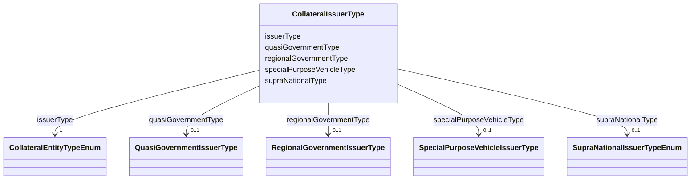

```mermaid
 classDiagram
    class CollateralIssuerType
    click CollateralIssuerType href "../CollateralIssuerType"
      CollateralIssuerType : issuerType
        
          
    
        
        
        CollateralIssuerType --> "1" CollateralEntityTypeEnum : issuerType
        click CollateralEntityTypeEnum href "../CollateralEntityTypeEnum"
    

        
      CollateralIssuerType : quasiGovernmentType
        
          
    
        
        
        CollateralIssuerType --> "0..1" QuasiGovernmentIssuerType : quasiGovernmentType
        click QuasiGovernmentIssuerType href "../QuasiGovernmentIssuerType"
    

        
      CollateralIssuerType : regionalGovernmentType
        
          
    
        
        
        CollateralIssuerType --> "0..1" RegionalGovernmentIssuerType : regionalGovernmentType
        click RegionalGovernmentIssuerType href "../RegionalGovernmentIssuerType"
    

        
      CollateralIssuerType : specialPurposeVehicleType
        
          
    
        
        
        CollateralIssuerType --> "0..1" SpecialPurposeVehicleIssuerType : specialPurposeVehicleType
        click SpecialPurposeVehicleIssuerType href "../SpecialPurposeVehicleIssuerType"
    

        
      CollateralIssuerType : supraNationalType
        
          
    
        
        
        CollateralIssuerType --> "0..1" SupraNationalIssuerTypeEnum : supraNationalType
        click SupraNationalIssuerTypeEnum href "../SupraNationalIssuerTypeEnum"
    

        
      
```
