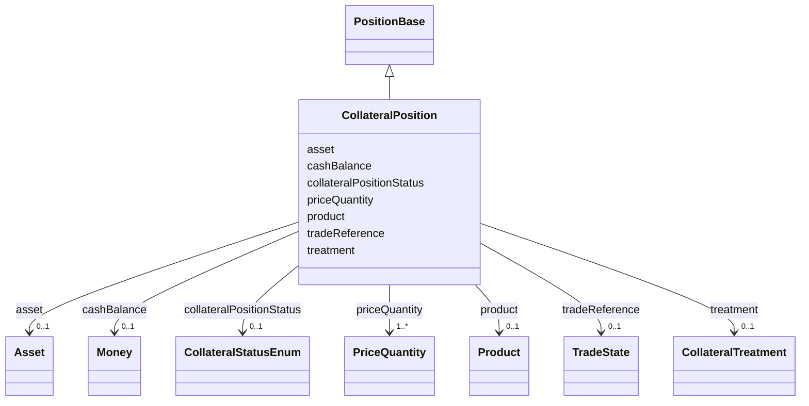

```mermaid
 classDiagram
    class CollateralPosition
    click CollateralPosition href "../CollateralPosition"
      PositionBase <|-- CollateralPosition
        click PositionBase href "../PositionBase"
      
      CollateralPosition : asset
        
          
    
        
        
        CollateralPosition --> "0..1" Asset : asset
        click Asset href "../Asset"
    

        
      CollateralPosition : cashBalance
        
          
    
        
        
        CollateralPosition --> "0..1" Money : cashBalance
        click Money href "../Money"
    

        
      CollateralPosition : collateralPositionStatus
        
          
    
        
        
        CollateralPosition --> "0..1" CollateralStatusEnum : collateralPositionStatus
        click CollateralStatusEnum href "../CollateralStatusEnum"
    

        
      CollateralPosition : priceQuantity
        
          
    
        
        
        CollateralPosition --> "1..*" PriceQuantity : priceQuantity
        click PriceQuantity href "../PriceQuantity"
    

        
      CollateralPosition : product
        
          
    
        
        
        CollateralPosition --> "0..1" Product : product
        click Product href "../Product"
    

        
      CollateralPosition : tradeReference
        
          
    
        
        
        CollateralPosition --> "0..1" TradeState : tradeReference
        click TradeState href "../TradeState"
    

        
      CollateralPosition : treatment
        
          
    
        
        
        CollateralPosition --> "0..1" CollateralTreatment : treatment
        click CollateralTreatment href "../CollateralTreatment"
    

        
      
```
