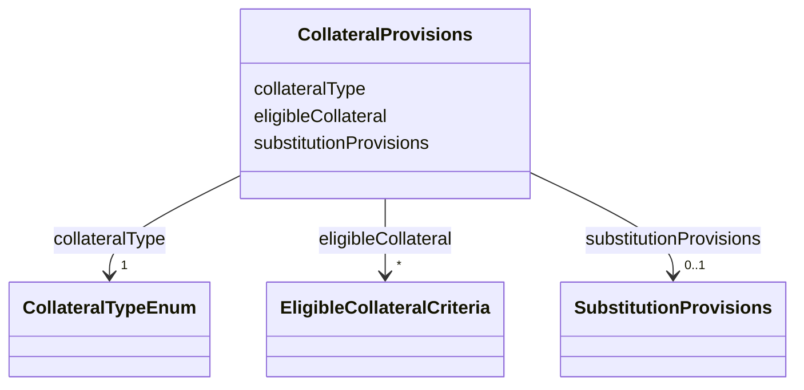

```mermaid
 classDiagram
    class CollateralProvisions
    click CollateralProvisions href "../CollateralProvisions"
      CollateralProvisions : collateralType
        
          
    
        
        
        CollateralProvisions --> "1" CollateralTypeEnum : collateralType
        click CollateralTypeEnum href "../CollateralTypeEnum"
    

        
      CollateralProvisions : eligibleCollateral
        
          
    
        
        
        CollateralProvisions --> "*" EligibleCollateralCriteria : eligibleCollateral
        click EligibleCollateralCriteria href "../EligibleCollateralCriteria"
    

        
      CollateralProvisions : substitutionProvisions
        
          
    
        
        
        CollateralProvisions --> "0..1" SubstitutionProvisions : substitutionProvisions
        click SubstitutionProvisions href "../SubstitutionProvisions"
    

        
      
```
