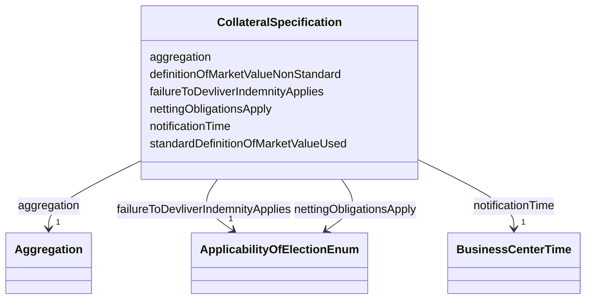

```mermaid
 classDiagram
    class CollateralSpecification
    click CollateralSpecification href "../CollateralSpecification"
      CollateralSpecification : aggregation
        
          
    
        
        
        CollateralSpecification --> "1" Aggregation : aggregation
        click Aggregation href "../Aggregation"
    

        
      CollateralSpecification : definitionOfMarketValueNonStandard
        
      CollateralSpecification : failureToDevliverIndemnityApplies
        
          
    
        
        
        CollateralSpecification --> "1" ApplicabilityOfElectionEnum : failureToDevliverIndemnityApplies
        click ApplicabilityOfElectionEnum href "../ApplicabilityOfElectionEnum"
    

        
      CollateralSpecification : nettingObligationsApply
        
          
    
        
        
        CollateralSpecification --> "1" ApplicabilityOfElectionEnum : nettingObligationsApply
        click ApplicabilityOfElectionEnum href "../ApplicabilityOfElectionEnum"
    

        
      CollateralSpecification : notificationTime
        
          
    
        
        
        CollateralSpecification --> "1" BusinessCenterTime : notificationTime
        click BusinessCenterTime href "../BusinessCenterTime"
    

        
      CollateralSpecification : standardDefinitionOfMarketValueUsed
        
      
```
