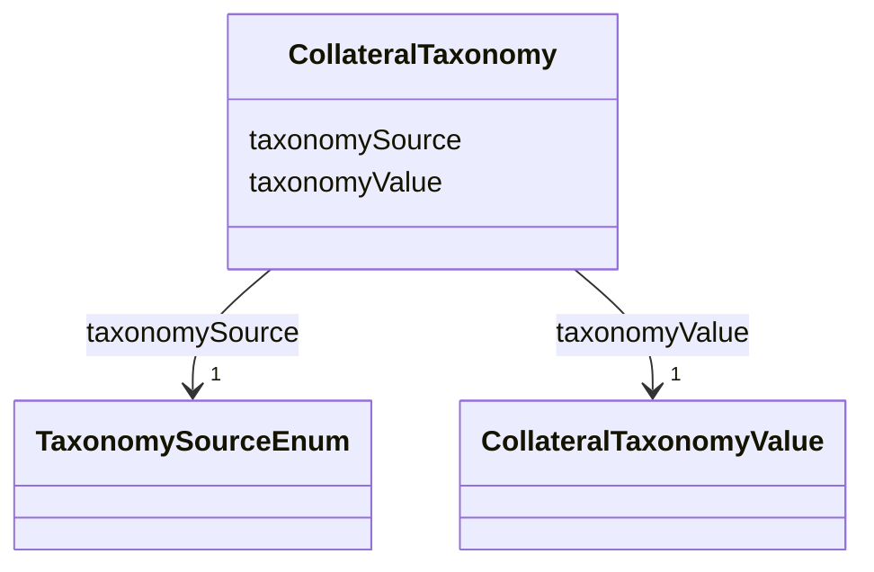

```mermaid
 classDiagram
    class CollateralTaxonomy
    click CollateralTaxonomy href "../CollateralTaxonomy"
      CollateralTaxonomy : taxonomySource
        
          
    
        
        
        CollateralTaxonomy --> "1" TaxonomySourceEnum : taxonomySource
        click TaxonomySourceEnum href "../TaxonomySourceEnum"
    

        
      CollateralTaxonomy : taxonomyValue
        
          
    
        
        
        CollateralTaxonomy --> "1" CollateralTaxonomyValue : taxonomyValue
        click CollateralTaxonomyValue href "../CollateralTaxonomyValue"
    

        
      
```
