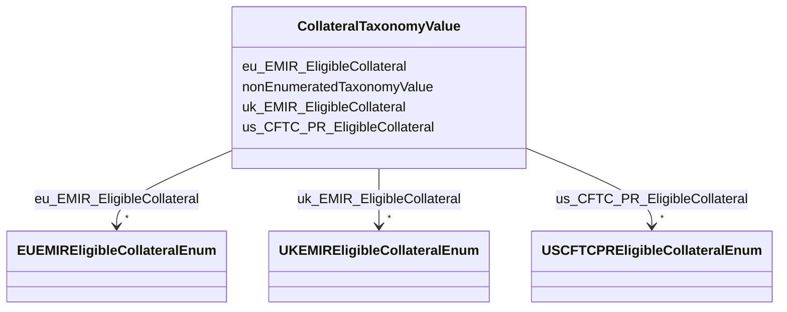

```mermaid
 classDiagram
    class CollateralTaxonomyValue
    click CollateralTaxonomyValue href "../CollateralTaxonomyValue"
      CollateralTaxonomyValue : eu_EMIR_EligibleCollateral
        
          
    
        
        
        CollateralTaxonomyValue --> "*" EUEMIREligibleCollateralEnum : eu_EMIR_EligibleCollateral
        click EUEMIREligibleCollateralEnum href "../EUEMIREligibleCollateralEnum"
    

        
      CollateralTaxonomyValue : nonEnumeratedTaxonomyValue
        
      CollateralTaxonomyValue : uk_EMIR_EligibleCollateral
        
          
    
        
        
        CollateralTaxonomyValue --> "*" UKEMIREligibleCollateralEnum : uk_EMIR_EligibleCollateral
        click UKEMIREligibleCollateralEnum href "../UKEMIREligibleCollateralEnum"
    

        
      CollateralTaxonomyValue : us_CFTC_PR_EligibleCollateral
        
          
    
        
        
        CollateralTaxonomyValue --> "*" USCFTCPREligibleCollateralEnum : us_CFTC_PR_EligibleCollateral
        click USCFTCPREligibleCollateralEnum href "../USCFTCPREligibleCollateralEnum"
    

        
      
```
