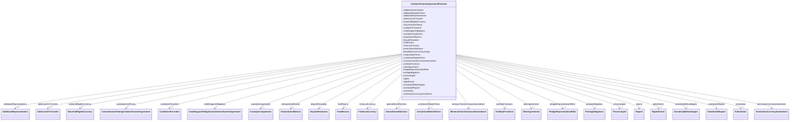

```mermaid
 classDiagram
    class CollateralTransferAgreementElections
    click CollateralTransferAgreementElections href "../CollateralTransferAgreementElections"
      CollateralTransferAgreementElections : additionalAmendments
        
      CollateralTransferAgreementElections : additionalBespokeTerms
        
      CollateralTransferAgreementElections : additionalRepresentations
        
          
    
        
        
        CollateralTransferAgreementElections --> "0..1" AdditionalRepresentations : additionalRepresentations
        click AdditionalRepresentations href "../AdditionalRepresentations"
    

        
      CollateralTransferAgreementElections : addressesForTransfer
        
          
    
        
        
        CollateralTransferAgreementElections --> "0..1" AddressesForTransfer : addressesForTransfer
        click AddressesForTransfer href "../AddressesForTransfer"
    

        
      CollateralTransferAgreementElections : baseAndEligibleCurrency
        
          
    
        
        
        CollateralTransferAgreementElections --> "1" BaseAndEligibleCurrency : baseAndEligibleCurrency
        click BaseAndEligibleCurrency href "../BaseAndEligibleCurrency"
    

        
      CollateralTransferAgreementElections : calculationAndTiming
        
          
    
        
        
        CollateralTransferAgreementElections --> "1" CalculationAndTimingCollateralTransferAgreement : calculationAndTiming
        click CalculationAndTimingCollateralTransferAgreement href "../CalculationAndTimingCollateralTransferAgreement"
    

        
      CollateralTransferAgreementElections : conditionsPrecedent
        
          
    
        
        
        CollateralTransferAgreementElections --> "0..1" ConditionsPrecedent : conditionsPrecedent
        click ConditionsPrecedent href "../ConditionsPrecedent"
    

        
      CollateralTransferAgreementElections : creditSupportObligations
        
          
    
        
        
        CollateralTransferAgreementElections --> "1" CreditSupportObligationsCollateralTransferAgreement : creditSupportObligations
        click CreditSupportObligationsCollateralTransferAgreement href "../CreditSupportObligationsCollateralTransferAgreement"
    

        
      CollateralTransferAgreementElections : custodyArrangements
        
          
    
        
        
        CollateralTransferAgreementElections --> "0..1" CustodyArrangements : custodyArrangements
        click CustodyArrangements href "../CustodyArrangements"
    

        
      CollateralTransferAgreementElections : demandsAndNotices
        
          
    
        
        
        CollateralTransferAgreementElections --> "0..1" DemandsAndNotices : demandsAndNotices
        click DemandsAndNotices href "../DemandsAndNotices"
    

        
      CollateralTransferAgreementElections : disputeResolution
        
          
    
        
        
        CollateralTransferAgreementElections --> "1" DisputeResolution : disputeResolution
        click DisputeResolution href "../DisputeResolution"
    

        
      CollateralTransferAgreementElections : finalReturns
        
          
    
        
        
        CollateralTransferAgreementElections --> "0..1" FinalReturns : finalReturns
        click FinalReturns href "../FinalReturns"
    

        
      CollateralTransferAgreementElections : fxHaircutCurrency
        
          
    
        
        
        CollateralTransferAgreementElections --> "0..1" FxHaircutCurrency : fxHaircutCurrency
        click FxHaircutCurrency href "../FxHaircutCurrency"
    

        
      CollateralTransferAgreementElections : generalSimmElections
        
          
    
        
        
        CollateralTransferAgreementElections --> "0..1" GeneralSimmElections : generalSimmElections
        click GeneralSimmElections href "../GeneralSimmElections"
    

        
      CollateralTransferAgreementElections : identifiedCrossCurrencySwap
        
      CollateralTransferAgreementElections : interpretationTerms
        
      CollateralTransferAgreementElections : jurisdictionRelatedTerms
        
          
    
        
        
        CollateralTransferAgreementElections --> "0..1" JurisdictionRelatedTerms : jurisdictionRelatedTerms
        click JurisdictionRelatedTerms href "../JurisdictionRelatedTerms"
    

        
      CollateralTransferAgreementElections : minimumTransferAmountAmendment
        
          
    
        
        
        CollateralTransferAgreementElections --> "1" MinimumTransferAmountAmendment : minimumTransferAmountAmendment
        click MinimumTransferAmountAmendment href "../MinimumTransferAmountAmendment"
    

        
      CollateralTransferAgreementElections : oneWayProvisions
        
          
    
        
        
        CollateralTransferAgreementElections --> "1" OneWayProvisions : oneWayProvisions
        click OneWayProvisions href "../OneWayProvisions"
    

        
      CollateralTransferAgreementElections : otherAgreements
        
          
    
        
        
        CollateralTransferAgreementElections --> "0..1" OtherAgreements : otherAgreements
        click OtherAgreements href "../OtherAgreements"
    

        
      CollateralTransferAgreementElections : pledgeeRepresentativeRider
        
          
    
        
        
        CollateralTransferAgreementElections --> "0..1" PledgeeRepresentativeRider : pledgeeRepresentativeRider
        click PledgeeRepresentativeRider href "../PledgeeRepresentativeRider"
    

        
      CollateralTransferAgreementElections : postingObligations
        
          
    
        
        
        CollateralTransferAgreementElections --> "1" PostingObligations : postingObligations
        click PostingObligations href "../PostingObligations"
    

        
      CollateralTransferAgreementElections : processAgent
        
          
    
        
        
        CollateralTransferAgreementElections --> "0..1" ProcessAgent : processAgent
        click ProcessAgent href "../ProcessAgent"
    

        
      CollateralTransferAgreementElections : regime
        
          
    
        
        
        CollateralTransferAgreementElections --> "1" Regime : regime
        click Regime href "../Regime"
    

        
      CollateralTransferAgreementElections : rightsEvents
        
          
    
        
        
        CollateralTransferAgreementElections --> "0..1" RightsEvents : rightsEvents
        click RightsEvents href "../RightsEvents"
    

        
      CollateralTransferAgreementElections : sensitivityMethodologies
        
          
    
        
        
        CollateralTransferAgreementElections --> "1" SensitivityMethodologies : sensitivityMethodologies
        click SensitivityMethodologies href "../SensitivityMethodologies"
    

        
      CollateralTransferAgreementElections : substitutedRegime
        
          
    
        
        
        CollateralTransferAgreementElections --> "*" SubstitutedRegime : substitutedRegime
        click SubstitutedRegime href "../SubstitutedRegime"
    

        
      CollateralTransferAgreementElections : substitution
        
          
    
        
        
        CollateralTransferAgreementElections --> "0..1" Substitution : substitution
        click Substitution href "../Substitution"
    

        
      CollateralTransferAgreementElections : terminationCurrencyAmendment
        
          
    
        
        
        CollateralTransferAgreementElections --> "1" TerminationCurrencyAmendment : terminationCurrencyAmendment
        click TerminationCurrencyAmendment href "../TerminationCurrencyAmendment"
    

        
      
```
