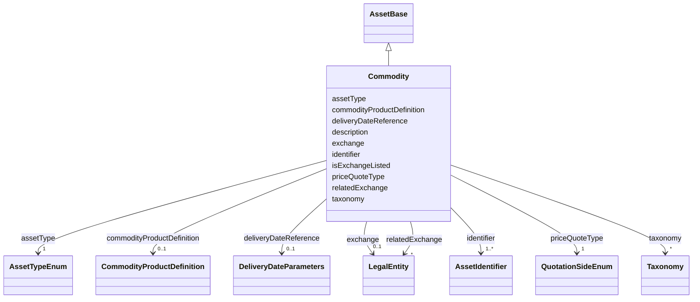

```mermaid
 classDiagram
    class Commodity
    click Commodity href "../Commodity"
      AssetBase <|-- Commodity
        click AssetBase href "../AssetBase"
      
      Commodity : assetType
        
          
    
        
        
        Commodity --> "1" AssetTypeEnum : assetType
        click AssetTypeEnum href "../AssetTypeEnum"
    

        
      Commodity : commodityProductDefinition
        
          
    
        
        
        Commodity --> "0..1" CommodityProductDefinition : commodityProductDefinition
        click CommodityProductDefinition href "../CommodityProductDefinition"
    

        
      Commodity : deliveryDateReference
        
          
    
        
        
        Commodity --> "0..1" DeliveryDateParameters : deliveryDateReference
        click DeliveryDateParameters href "../DeliveryDateParameters"
    

        
      Commodity : description
        
      Commodity : exchange
        
          
    
        
        
        Commodity --> "0..1" LegalEntity : exchange
        click LegalEntity href "../LegalEntity"
    

        
      Commodity : identifier
        
          
    
        
        
        Commodity --> "1..*" AssetIdentifier : identifier
        click AssetIdentifier href "../AssetIdentifier"
    

        
      Commodity : isExchangeListed
        
      Commodity : priceQuoteType
        
          
    
        
        
        Commodity --> "1" QuotationSideEnum : priceQuoteType
        click QuotationSideEnum href "../QuotationSideEnum"
    

        
      Commodity : relatedExchange
        
          
    
        
        
        Commodity --> "*" LegalEntity : relatedExchange
        click LegalEntity href "../LegalEntity"
    

        
      Commodity : taxonomy
        
          
    
        
        
        Commodity --> "*" Taxonomy : taxonomy
        click Taxonomy href "../Taxonomy"
    

        
      
```
