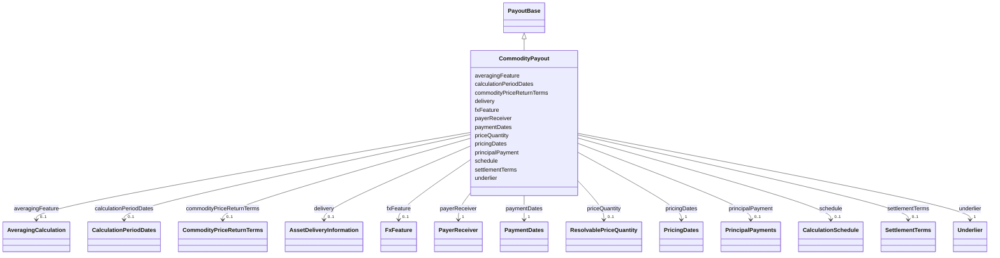

```mermaid
 classDiagram
    class CommodityPayout
    click CommodityPayout href "../CommodityPayout"
      PayoutBase <|-- CommodityPayout
        click PayoutBase href "../PayoutBase"
      
      CommodityPayout : averagingFeature
        
          
    
        
        
        CommodityPayout --> "0..1" AveragingCalculation : averagingFeature
        click AveragingCalculation href "../AveragingCalculation"
    

        
      CommodityPayout : calculationPeriodDates
        
          
    
        
        
        CommodityPayout --> "0..1" CalculationPeriodDates : calculationPeriodDates
        click CalculationPeriodDates href "../CalculationPeriodDates"
    

        
      CommodityPayout : commodityPriceReturnTerms
        
          
    
        
        
        CommodityPayout --> "0..1" CommodityPriceReturnTerms : commodityPriceReturnTerms
        click CommodityPriceReturnTerms href "../CommodityPriceReturnTerms"
    

        
      CommodityPayout : delivery
        
          
    
        
        
        CommodityPayout --> "0..1" AssetDeliveryInformation : delivery
        click AssetDeliveryInformation href "../AssetDeliveryInformation"
    

        
      CommodityPayout : fxFeature
        
          
    
        
        
        CommodityPayout --> "0..1" FxFeature : fxFeature
        click FxFeature href "../FxFeature"
    

        
      CommodityPayout : payerReceiver
        
          
    
        
        
        CommodityPayout --> "1" PayerReceiver : payerReceiver
        click PayerReceiver href "../PayerReceiver"
    

        
      CommodityPayout : paymentDates
        
          
    
        
        
        CommodityPayout --> "1" PaymentDates : paymentDates
        click PaymentDates href "../PaymentDates"
    

        
      CommodityPayout : priceQuantity
        
          
    
        
        
        CommodityPayout --> "0..1" ResolvablePriceQuantity : priceQuantity
        click ResolvablePriceQuantity href "../ResolvablePriceQuantity"
    

        
      CommodityPayout : pricingDates
        
          
    
        
        
        CommodityPayout --> "1" PricingDates : pricingDates
        click PricingDates href "../PricingDates"
    

        
      CommodityPayout : principalPayment
        
          
    
        
        
        CommodityPayout --> "0..1" PrincipalPayments : principalPayment
        click PrincipalPayments href "../PrincipalPayments"
    

        
      CommodityPayout : schedule
        
          
    
        
        
        CommodityPayout --> "0..1" CalculationSchedule : schedule
        click CalculationSchedule href "../CalculationSchedule"
    

        
      CommodityPayout : settlementTerms
        
          
    
        
        
        CommodityPayout --> "0..1" SettlementTerms : settlementTerms
        click SettlementTerms href "../SettlementTerms"
    

        
      CommodityPayout : underlier
        
          
    
        
        
        CommodityPayout --> "1" Underlier : underlier
        click Underlier href "../Underlier"
    

        
      
```
