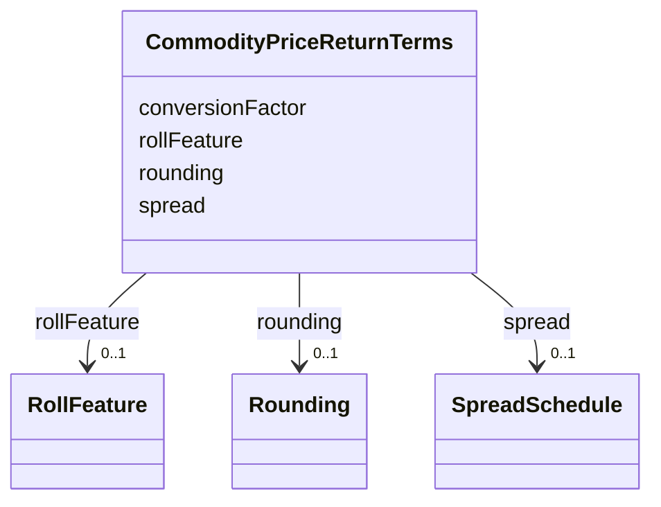

```mermaid
 classDiagram
    class CommodityPriceReturnTerms
    click CommodityPriceReturnTerms href "../CommodityPriceReturnTerms"
      CommodityPriceReturnTerms : conversionFactor
        
      CommodityPriceReturnTerms : rollFeature
        
          
    
        
        
        CommodityPriceReturnTerms --> "0..1" RollFeature : rollFeature
        click RollFeature href "../RollFeature"
    

        
      CommodityPriceReturnTerms : rounding
        
          
    
        
        
        CommodityPriceReturnTerms --> "0..1" Rounding : rounding
        click Rounding href "../Rounding"
    

        
      CommodityPriceReturnTerms : spread
        
          
    
        
        
        CommodityPriceReturnTerms --> "0..1" SpreadSchedule : spread
        click SpreadSchedule href "../SpreadSchedule"
    

        
      
```
