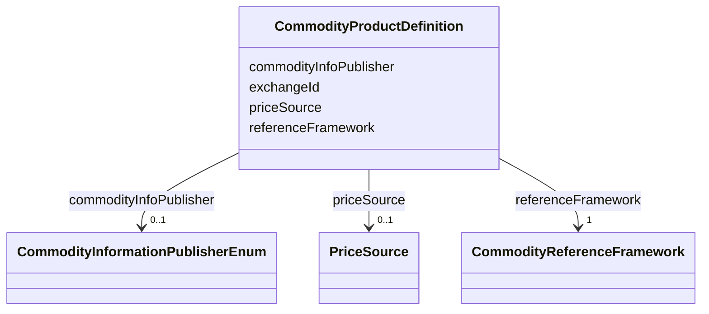

```mermaid
 classDiagram
    class CommodityProductDefinition
    click CommodityProductDefinition href "../CommodityProductDefinition"
      CommodityProductDefinition : commodityInfoPublisher
        
          
    
        
        
        CommodityProductDefinition --> "0..1" CommodityInformationPublisherEnum : commodityInfoPublisher
        click CommodityInformationPublisherEnum href "../CommodityInformationPublisherEnum"
    

        
      CommodityProductDefinition : exchangeId
        
      CommodityProductDefinition : priceSource
        
          
    
        
        
        CommodityProductDefinition --> "0..1" PriceSource : priceSource
        click PriceSource href "../PriceSource"
    

        
      CommodityProductDefinition : referenceFramework
        
          
    
        
        
        CommodityProductDefinition --> "1" CommodityReferenceFramework : referenceFramework
        click CommodityReferenceFramework href "../CommodityReferenceFramework"
    

        
      
```
