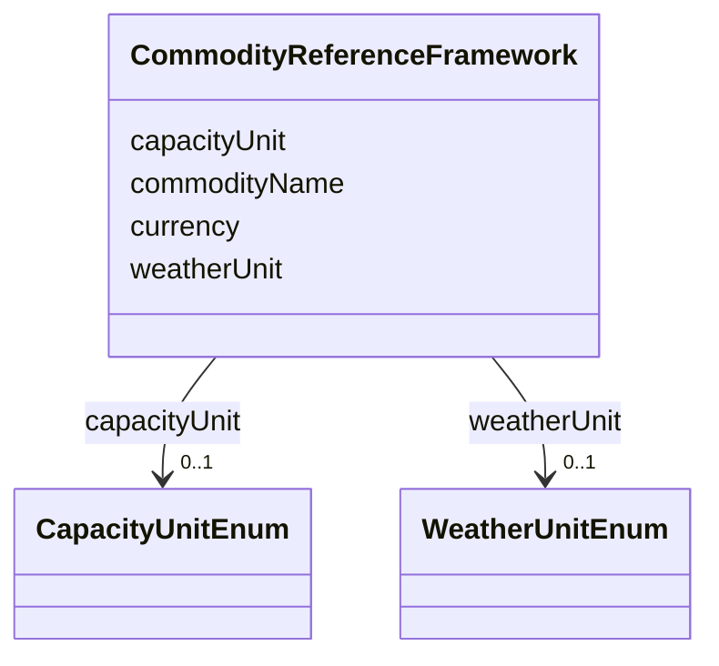

```mermaid
 classDiagram
    class CommodityReferenceFramework
    click CommodityReferenceFramework href "../CommodityReferenceFramework"
      CommodityReferenceFramework : capacityUnit
        
          
    
        
        
        CommodityReferenceFramework --> "0..1" CapacityUnitEnum : capacityUnit
        click CapacityUnitEnum href "../CapacityUnitEnum"
    

        
      CommodityReferenceFramework : commodityName
        
      CommodityReferenceFramework : currency
        
      CommodityReferenceFramework : weatherUnit
        
          
    
        
        
        CommodityReferenceFramework --> "0..1" WeatherUnitEnum : weatherUnit
        click WeatherUnitEnum href "../WeatherUnitEnum"
    

        
      
```
