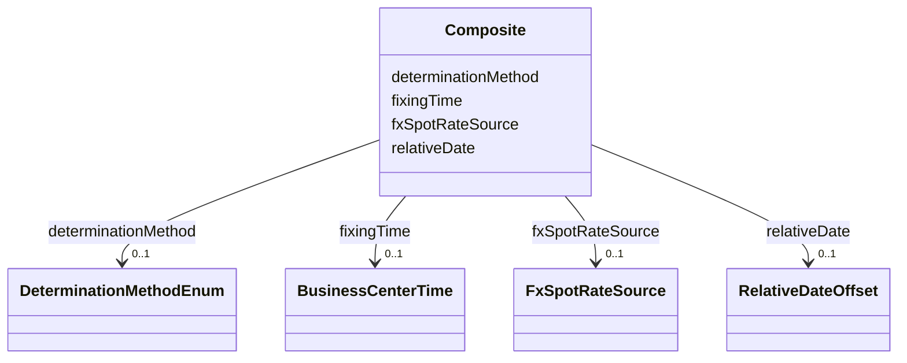

```mermaid
 classDiagram
    class Composite
    click Composite href "../Composite"
      Composite : determinationMethod
        
          
    
        
        
        Composite --> "0..1" DeterminationMethodEnum : determinationMethod
        click DeterminationMethodEnum href "../DeterminationMethodEnum"
    

        
      Composite : fixingTime
        
          
    
        
        
        Composite --> "0..1" BusinessCenterTime : fixingTime
        click BusinessCenterTime href "../BusinessCenterTime"
    

        
      Composite : fxSpotRateSource
        
          
    
        
        
        Composite --> "0..1" FxSpotRateSource : fxSpotRateSource
        click FxSpotRateSource href "../FxSpotRateSource"
    

        
      Composite : relativeDate
        
          
    
        
        
        Composite --> "0..1" RelativeDateOffset : relativeDate
        click RelativeDateOffset href "../RelativeDateOffset"
    

        
      
```
